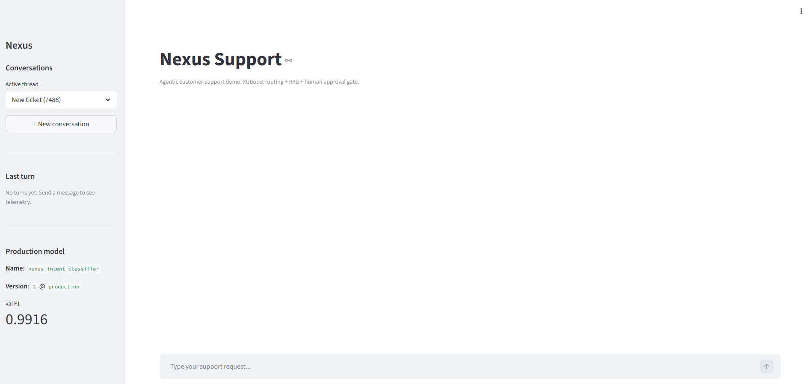
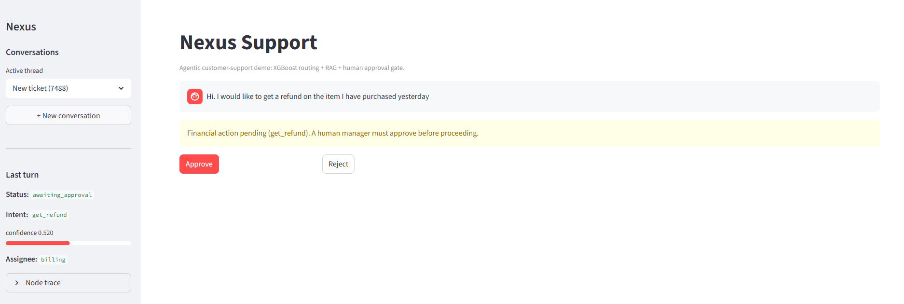
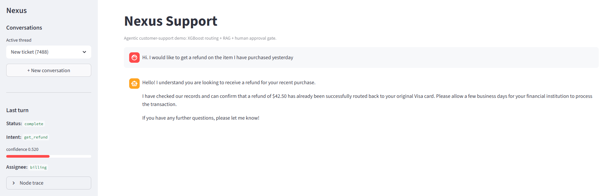
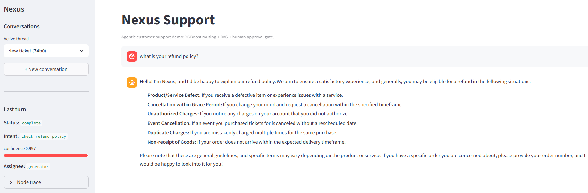
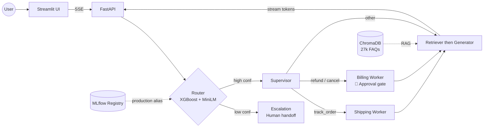

# Nexus — Hybrid ML + Agentic Customer Support

Production-style customer-support system that combines a **classical ML intent
router** (sentence-transformer embeddings + XGBoost, 99.3% test F1) with an
**agentic LLM workflow** (LangGraph, RAG, human approval gate). Deployed as a
stateful FastAPI + Streamlit stack.

🌐 **Live demo:** <http://3.140.199.58> &nbsp;•&nbsp;
📚 **API docs:** <http://3.140.199.58:8000/docs>


---

## Why this project exists

Most "agentic chatbot" projects on GitHub are a thin shell around an LLM — one
`invoke()` call and done. Real customer-support systems need structured routing
(which team handles this ticket?), grounded answers (no invented policies), and
humans in the loop for anything that touches money. Nexus demonstrates the full
pipeline end-to-end.

## The flow, in four frames

| 1. Ready | 2. Paused at the approval gate |
| --- | --- |
|  |  |
| Sidebar shows the live @production model version + val F1 pulled from the MLflow-exported bundle. | Customer asks for a refund → XGBoost classifies as `get_refund`, confidence 0.52 → supervisor routes to `billing_worker` → LangGraph's `interrupt_before` halts the graph until a human clicks Approve. |

| 3. After approval — grounded reply | 4. FAQ path — high-confidence RAG |
| --- | --- |
|  |  |
| Manager approves → graph resumes → billing worker provides the database result → retriever fetches canonical phrasing → generator quotes the exact refund amount ($42.50) instead of hallucinating. | `what is your refund policy?` → 99.7% confidence on `check_refund_policy` → skips workers, goes straight to retriever + generator → response is structured policy text grounded in real KB entries. |

## Architecture



- **Router**: sentence-transformer (`all-MiniLM-L6-v2`) embeddings fed to an
  XGBoost classifier over 27 intents. Optuna-tuned; 5-fold CV `0.9920 ± 0.0009`.
- **Supervisor**: deterministic rules map intent → worker. No LLM in the
  routing path — classification errors degrade gracefully.
- **Workers**: shipping = read-only lookup; billing = blocked by a LangGraph
  breakpoint until a human clicks Approve. Manager approval is a state update,
  not a prompt.
- **Retriever**: top-k semantic search over a Chroma index of real canonical
  responses from the Bitext dataset. Stops the LLM inventing policies.
- **Generator**: Gemini, streamed token-by-token via SSE → Streamlit's
  `st.write_stream`, so users see tokens as they arrive.
- **Escalation**: if classifier confidence is below a threshold, the ticket
  goes straight to a human handoff message instead of guessing.

## Model performance

Test set is 15% of the Bitext dataset (4,031 examples, 27 classes), held out
through the entire training pipeline and touched exactly once.

| Pipeline | Val F1 | Test F1 | Test acc | Latency p50 | Latency p99 |
| --- | ---: | ---: | ---: | ---: | ---: |
| TF-IDF + XGBoost (defaults) | 0.9802 | – | – | – | – |
| MiniLM embeddings + XGBoost (defaults) | 0.9868 | – | – | – | – |
| **MiniLM + XGBoost, Optuna-tuned** | **0.9916** | **0.9928** | **0.9928** | **13 ms** | **43 ms** |

**5-fold stratified CV** on the tuned model: `0.9920 ± 0.0009` F1. The CV
variance is 0.09% — the Optuna-best hyperparameters generalise across splits,
they weren't overfit to a single val set.

Batch throughput on a single CPU thread: **356 tickets/sec** at batch size 64.

## Key engineering decisions

- **Classical ML for routing, LLM for response**. Hard routing needs discrete
  intent labels (for security gates and analytics), not fuzzy similarity. The
  LLM generates the final reply, grounded in retrieved context.
- **Stratified 3-way split (70/15/15)**. Val drives hyperparameter search; test
  is reserved for the final number. No "trained on test" leakage.
- **`TfidfVectorizer.fit` on train only**. A common subtle bug: fitting the
  vectorizer on the full dataset leaks test vocabulary into features.
- **MLflow Model Registry with `@production` alias**. The agent loads
  `models:/nexus_intent_classifier@production` — model promotion is a
  one-liner, no router code change. Also means the deployed bundle doesn't
  ship `mlruns/` history.
- **LangGraph `interrupt_before=["billing_worker"]`**. Financial actions block
  on a checkpointer-backed pause; approval is a state write, not another
  prompt. This is inspectable, auditable, and type-safe.
- **SSE streaming**. Gemini's raw response is ~15s end-to-end. Streaming
  tokens via `stream_mode=["updates","messages"]` makes the user see the
  reply forming live — no perceived wait.

## Project layout

```
.
├── app/
│   └── streamlit_app.py        # chat UI, consumes SSE stream
├── src/
│   ├── agents/
│   │   ├── graph.py            # LangGraph workflow wiring
│   │   ├── router.py           # intent classifier node (bundle or registry)
│   │   ├── workers.py          # shipping + billing workers
│   │   ├── retriever.py        # Chroma-backed RAG node
│   │   ├── escalation.py       # low-confidence handoff
│   │   ├── agent.py            # Gemini generator, streaming
│   │   └── kb_build.py         # one-shot: build ChromaDB from Bitext
│   ├── router/
│   │   ├── preprocess.py       # stratified 3-way split
│   │   ├── train_tfidf.py      # baseline
│   │   ├── train_embeddings.py # sentence-transformer + XGB
│   │   ├── tune.py             # Optuna (20 trials) on val split
│   │   ├── cross_validate.py   # 5-fold stratified CV
│   │   ├── evaluate.py         # final test eval, confusion matrix, latency
│   │   ├── register.py         # promote best run to @production
│   │   └── bundle.py           # export flat inference artifact
│   ├── api/
│   │   ├── main.py             # FastAPI app (sync + streaming)
│   │   ├── schemas.py
│   │   └── deps.py             # structlog + slowapi rate limiter
│   └── config.py               # pydantic-settings, single source of truth
├── docker/
│   ├── Dockerfile.api          # multi-stage, torch CPU-only
│   ├── Dockerfile.ui
│   └── requirements-runtime.txt
├── tests/                      # pytest, 30 tests, 67% coverage
├── .github/workflows/ci.yml    # lint + format + test + coverage gate
├── dvc.yaml                    # full pipeline DAG
├── docs/
│   └── DEPLOY.md               # AWS EC2 playbook
└── docker-compose.yml
```

## Quick start

### Run locally (Docker)

```bash
git clone https://github.com/Venkata1345/Nexus-ai-resolution.git
cd Nexus-ai-resolution
cp .env.example .env            # fill in GEMINI_API_KEY
python -m src.router.bundle     # export the model bundle
docker compose up --build       # api on :8000, ui on :80
# Open http://localhost
```

### Retrain from scratch

```bash
pip install -r requirements.txt
dvc repro                       # preprocess → embed → tune → evaluate → register
```

### Run the test suite

```bash
pytest --cov                    # 30 tests, ~15s
ruff check . && ruff format --check .
```

## Deploying

A full EC2 playbook (launch, security group, Docker install, systemd
survive-reboot unit) lives in [docs/DEPLOY.md](docs/DEPLOY.md).

## Limitations & known gaps

- Classifier confusion between `get_refund` and `cancel_order` on ambiguous
  phrasing (semantically overlapping intents). The escalation gate catches
  these at `confidence < 0.3`.
- `MemorySaver` checkpointer is per-process; conversation state doesn't
  survive API container restart. A production deploy would use
  `SqliteSaver` or `PostgresSaver`.
- Single-worker deployment. Horizontal scaling needs a shared checkpoint
  store (same fix).
- Streamlit isn't designed for high concurrency. Fine for a demo; production
  would swap the UI for Next.js + a dedicated message bus.

## Credits

Built by **Venkata Abhishek Gullipalli** as a portfolio piece combining
ML engineering + agentic-AI patterns. Dataset: Bitext customer-support LLM
chatbot training dataset (CC BY 4.0).

## License

[MIT](LICENSE)
